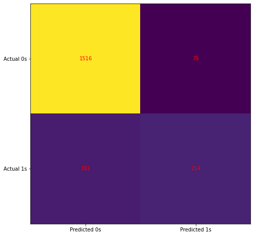

# Artificial_Neural_Network

The objective here is to develop a demographic segmentation model that will notify the bank which of its clients are most likely to leave. I've got an input vector with various properties, and I'm going to use artificial neural networks to predict a result, which will be a binary variable. To begin, I performed some encoding work to transform the categorical data to numerical data. Then I used feature scaling, which is highly recommended when using an ANN model for classification. Then, with one input layer, two hidden layers, and one output layer, I built the ANN. I used the Adam optimizer to create the ANN model, which uses stochastic gradient descent, binary crossentropy as a loss function, and accuracy metrics.Model was trained with 100 epochs, and loss function is observed to reduced epoch by epoch. The confusion matrix accuracy is 0.865.

```bash
$ pip install -r requirement.txt
```


